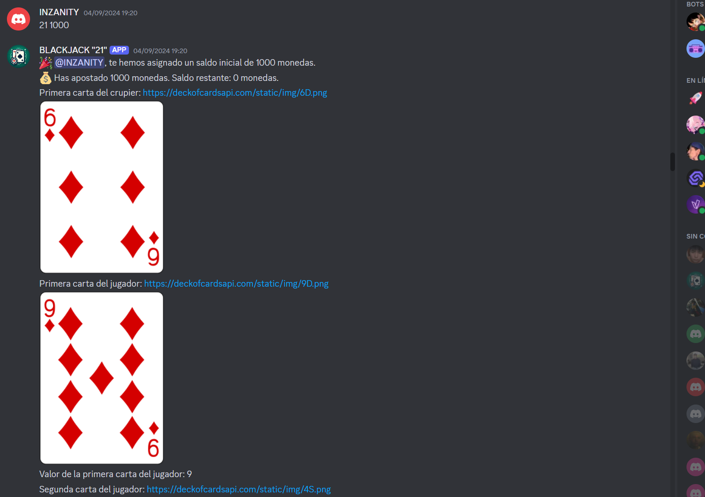
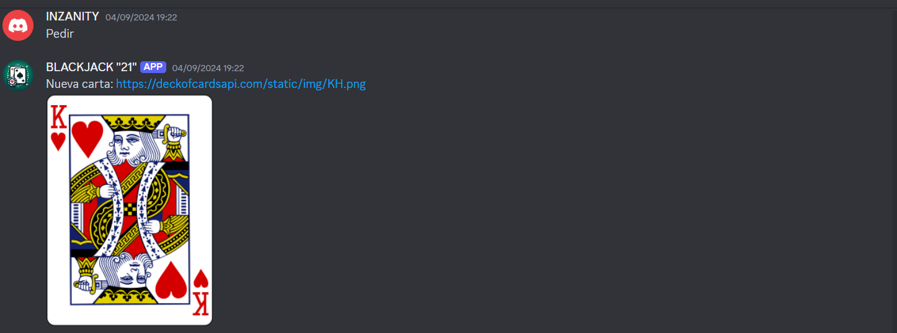
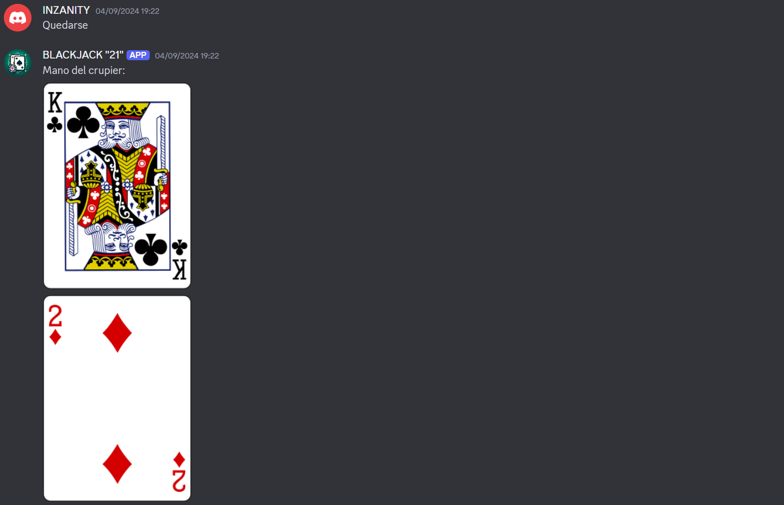
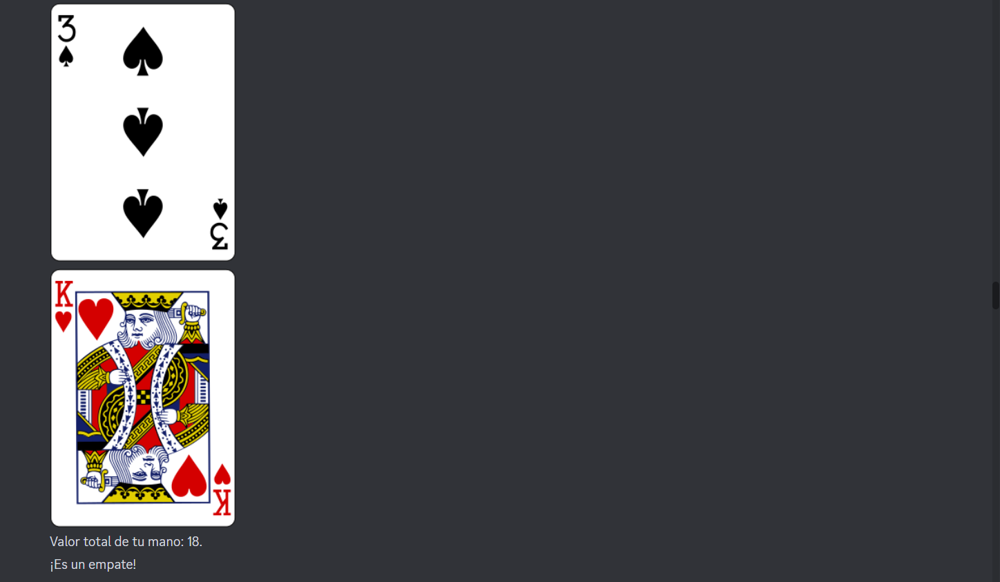

# 🃏 Blackjack Bot 🎰

Un bot de Discord para jugar al **Blackjack (21)** con cartas virtuales utilizando la API de [Deck of Cards](https://www.deckofcardsapi.com/).

---

## 🚀 **Características**
✅ Juega una partida de Blackjack en Discord.  
✅ Usa comandos para **pedir cartas** o **quedarse**.  
✅ El crupier sigue las reglas oficiales del juego.  
✅ Cálculo automático de valores de las cartas, incluyendo **Ases ajustables**.  
✅ Mensajes dinámicos con imágenes de las cartas.  

---

## 🎮 **Comandos del Bot**

- `21` → Inicia una nueva partida.
- `Pedir` → Solicita una carta nueva.
- `Quedarse` → Mantiene la mano y permite jugar al crupier.

---

## 📸 **Capturas de Pantalla**

### 🎴 **Inicio de la partida**
<p align="center">
  
</p>

### 🔥 **Pedir**
<p align="center">
  
</p>

### 👁️‍🗨️ **Quedarse**
<p align="center">
  
</p>

### ⬅️ **Quedarse**
<p align="center">

  
</p>

---

## 🛠 **Instalación y Uso**

### 1️⃣ **Clonar el repositorio**  
```sh
git clone https://github.com/usuario/blackjack-bot.git
cd blackjack-bot
```

### 2️⃣ **Instalar dependencias**  
```sh
pip install -r requirements.txt
```

### 3️⃣ **Configurar el token de Discord**  
Abre el archivo `21_bot.py` y reemplaza `client.run('')` con tu token de bot de Discord:
```python
client.run('TU_TOKEN_AQUI')
```

### 4️⃣ **Ejecutar el bot**  
```sh
python 21_bot.py
```

---

## 📝 **Licencia**
Este proyecto está bajo la licencia **MIT**. ¡Siéntete libre de usarlo y modificarlo! 🎲✨

